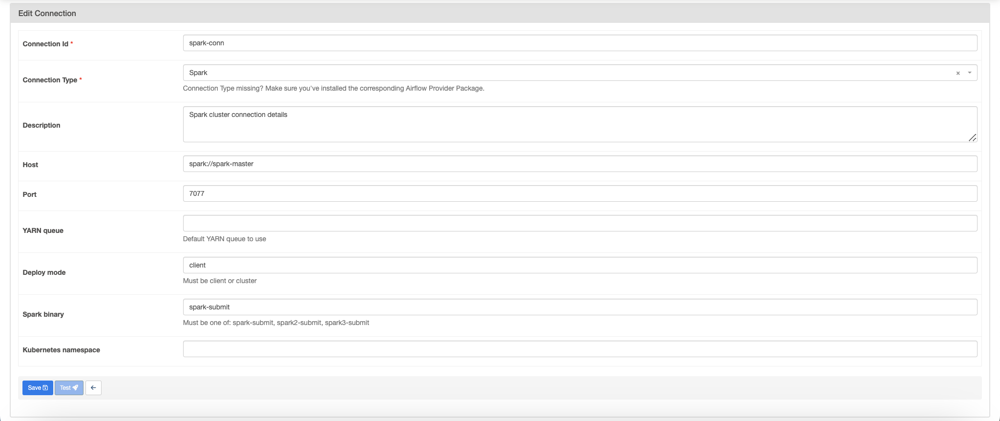

# Prerequisites

Have the docker daemon (Docker Desktop works) and that is it !

# Launch the project

Clone the project then cd into it
```
docker build . -f Dockerfile --pull --tag apache/airflow:2.7.1

docker compose up (please wait until all containers are ready : 5 mins approx.)
```

Go to **localhost:8080** for accessing airflow, creds are airflow for id and airflow for password as well.

Then add a connection in the admin/connection portal of airflow to enable connection between spark and airflow (see image below)



Then launch in this order : 

    1. dag etl 

    2. dag preprocessing (don't wait until its finished because it won't end : kafka consumer is watching) 

    3. launch kafka_dag if you want to refresh the time for train/metro (by default it is set to 5 mins to avoid using too much API calls)

Please reach us, if you have any questions or difficulties, we will be happy to fix the issue !